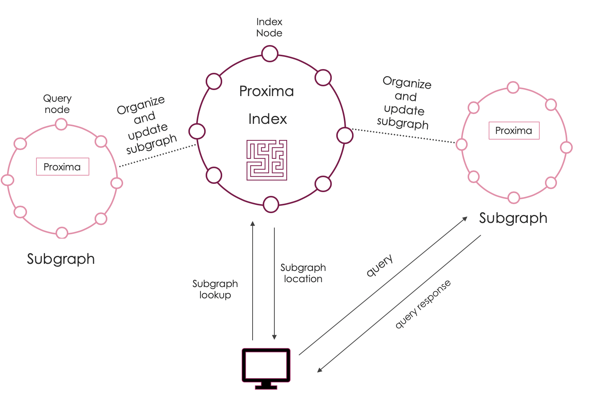
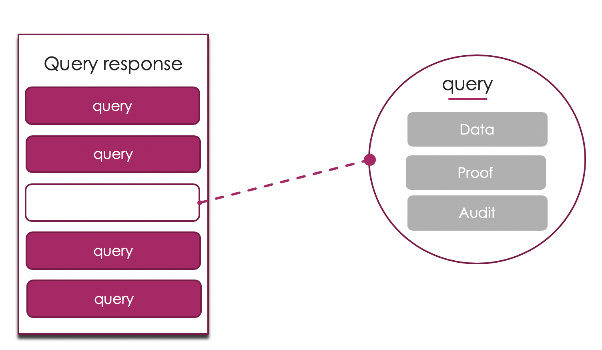

# Proxima

## What do we do?
Blockchain data is tough to truly authenticate. 
How do you know that you are getting accurate and sound data from the correct blockchain? You have no idea if the data coming from your account balance, query, or Decentralized application events are accurate and timely. The result can lead to major issues with visibility, analytics, and finances within your business. It can mean the difference between (a popping phrase for success here) or failure. 

### Examples

- *Did my user pay? What are the interest rates?* 
- *How many users are there? What do my orders look like?* 
- *What is my account balance? What transactions have I been a part of?*

When dealing with data security it is not enough to “trust”. Proxima provides the convenience, feature set, and speed of centralized providers AND maintains the audibility and trustlessness of the blockchain.

## Our goal 
Decentralize the ability to **provide data, interact with data** to **empower DApp developers**, provide tools that **speed up the creation of DApps**, and **drive adoption of blockchain technology**. Our solution is general enough to **enable our decentralized data providers** to provide data for DApps **for several blockchains / smart contract platforms**, while basing our **security on the consensus of the blockchain that the data is coming from**.

## Our Product
We provide default event mappings for every developer so there is no setup needed aside from listing the contract ABI code, the data source, and the address.

## Benefits 

- **Security**

- **Lower latency** 

- **Lower cost** 

## Stakeholders
*There exist three major stakeholders in the Proxima ecosystem. 

- **Blockchains**


- **Decentralized Applications** 

- **Users**


### Features
- *Events, State*
- *Filtering (soundness, not completeness), Range* (soundness, not completeness)*
- *Blockchain agnostic*
- *Trustless data*
- *Performant queries*


### Example Use Case

#### Goal
A developer wants to query the blockchain, to get data from a specific DApp, a decentralized exchange. This DApp utilizes multiple smart contracts to maintain orderbooks and reserves in a decentralized manner. The goal is to get a cohesive view of the orderbooks, reserves, and exchange in a fast, secure manner.

#### Problem
The current method of blockchain querying would be to have the developer write a custom-solution that queries each individual contract, formats the data, and delivers it to the user. Along with being difficult to create for the developer, this type of system experiences high latency with requests taking minutes. 

#### Solution
The developer can make a Proxima data node that incorporates subgraphs for each of the reserves and orderbooks for their exchange. These subgraphs can be autogenerated to collect events, state, and ensure that this state is truly tied to the blockchain through an authenticated data structure. This enables the developer to have faster queries by several orders of magnitude, while maintaining the security of the blockchain they are querying from.

#### Outcomes
- Faster queries
- Lower storage footprint
- Trustless queries
- Greater Scalability 
- Easier interface
- Lower costs

## How do we do it?
Proxima provides default mapping of events and stores them within an authenticated data store, giving developers the ability to query this through a graphQL interface. Queries are done through a specialized node that uses an authenticated data store to provide a Merkle-proof for the query. To ensure the security of the data, Proxima leaves an auditable trail for DApp developers to trace the path of their data to its source. We cannot change the authenticated data structure, so security does not have to be re-tried by each new user.



### Index Nodes 
The index node is responsible for connecting the queries to the correct "subgraph". They will maintain a smart contract index of subgraphs with bootstraps, and eventually be responsible for dealing with payments and subscriptions. The index of subgraphs will be represented as a smart contract on Ethereum through the testnet phase. Eventually the index will be migrated to a higher throughput chain, like the tendermint sidechain on Cosmos. 

*Note: the index nodes do not actually store any "subgraphs", they simply connect to subgraphs stored by the query nodes.*

### Query Nodes 
Query nodes are responsible for storing and providing data for subgraphs. Query nodes can be deployed to our hosting DNS service through a manifest that defines data sources, contracts, and any extra mappings. This manifest is deployed to the IPNS, to enable deployment to the mesh as well as deployment to our own hosting solution.

### Subgraphs

Subgraphs represent a contained data set that can be queried, auditted, and reused within the Proxima network. The easiest analogy for subgraphs, is that they represent tables of data complete with schema, transformations, and queries.

```
subgraph
  entities:
    - ...
  schema: 
    - ...
  mappings:
    - ...
  datasources:
    -  ... 
```

### Entities
Entities are formulations of objects in Proxima. They can represent Users, Accounts, Items, Orders, etc. The entity will define the values, the "audits" associated with the values, and how to index/write the objects to the authenticated database.

  #### Schema
  The schema exists as a part of the entity, it will enable queries, and show the data that is held within the entity. This 
  schema will eventually be able to contain other entities. 

  #### Verification
  Each entity has a function(s) that will verify the validity of the data they hold. An example of this would be a block    
  entity have a verification function that ensures the blockhead hashes to the blockhash. 
  
  #### Audits
  An entity will have data from other sources, it is necessary to be able to audit this data. Entities have specific    
  subroutines that take run queries on subgraphs. These queries are known as "audits", and they will ensure the validity of 
  the data given. An example of such an audit would be a query for a Transaction that checks if the block, associated with the 
  blockHash, exists.
  
  #### Example: Transaction
  An example entity to use is a transaction, (a UTXO in this case). Look at how the schema defines the data, the 
  
   #### Schema
   
    ```
    Transaction {
        transactionHash: Uint256
        from: Address
        to: Address
        value: Uint256
        signature: bytes
        blockHash: Uint256
    }
    ```
  
   #### Verification
   The verification in this case would be to ensure that the signed Transaction was hashed to the correct Hash. Put simply it   would look like: 
   
   ```javascript
   function verification(Transaction, transactionHash) {
      return keccak256(Transaction) == transactionHash
   }
   ```
  
   #### Audits
   The auditting process would include a query and a validation function. For the transaction it would query the blockHash, 
   then it would perform the validation function that checks that the transaction is in Transaction Trie of the selected 
   Block. 
  
  ```javascript
  function AuditTransaction(Transaction) {
    Block = Query(Transaction)
    return Block AND Validate(Transaction, Block)
  }
  ```
  
  
  ##### Query 
   ```javascript
   function Query(Transaction) {
      Block, Proof = get('subgraph blocks', Transaction.BlockHash)
      if Proof.verify:
        return Block
      return null
   }
   ```
   
  ##### Validation
   ```javascript
   function Validate(Transaction, Block) {
    return (Transaction.Hash in Block.TransactionTrie)
   }
   ``` 

### Datasources
Subgraphs can be used by other subgraphs (e.g. Ethereum subgraph being used by DApps), these are defined as datasources.

#### Subgraphs
Subgraphs can be used as a datasource for other subgraphs. These subgraphs are referenced and used through the Proxima Index Node. This method makes it easy to define and use subgraphs.

```  
  datasource:
      type: Subgraph
       id: Ethereum-Subgraph
      name: Ethereum
```

#### External data sources

External datasources are more difficult to build, and must contain pre-built entities. By doing this it is possible to use the external datasource in the same manner that a subgraph can be used. 

```  
  datasource:
      type: External
      name: Ethereum
      ingestor: ...
      entities: ...
      mapping:
      - handlers
      - abi/schema
```

## Queries
Queries in Proxima, are given responses that are broken into entities. Each entity represents an individual data record that is being requested in the query itself. Since they are designed to be verifiable, they have components for proofs audits.



Each *entity* within a query is composed of the following attributes: 

#### Data
The data contained within each identity is associated with the schema of the entity itself. This is what the query is looking at.
#### Proof
This is the *proof-of-membership* within the Proxima Database. The Proof itself relies on the Merkle root of the database, and is authenticated with the hash of the value. 

#### Audits
The audit provides a *Proof-of-Correctness* for the entity that is being queried, and is sourced by the entity itself. This involves conducting a separate query query of data that is directly tied to the entity. For example, a transaction "audit" would return the block whose blockhash is referenced by the transaction, and a proof-of-membership for this block.

## Authenticated Datastore
Proxima uses ProximaDB, a bolt-on component of the powerful Urkel NoSQL database, that implements a Flat-File Merkle Trie (FFMT). We utilize the Flat-File Merkle Trie, like see in Urkel, because of the query speed (>1 ms), the reduced size of the proofs (>1kb), as well as the low storage footprint. FFMTs are especially useful in this implementation because they map from the internal nodes of the trie directly to the location of the data that they are referencing. For more information on this check out the [Handshake paper](https://handshake.org/files/handshake.txt).

Along with adding features like range queries and load-balancing, Ruffle provides the default authentication and performance seen in the Urkel database. Our data store provides Merkle proofs for data to ensure the authenticity and immutability of all data within it.

## Audits
The blocks of a blockchain are immutable, but blocks are only linked to their immediate neighbors, so the history of the blockchain can only be verified by downloading the entire chain. This means that it is only possible to audit data (e.g. transactions, state, and blocks) from a blockchain, by running a full node and synchronizing with every block in the blockchain’s history. 

Our system maintains the same auditing structure of blockchains, but it stores blocks within an authenticated database, so it is possible to verify membership of blocks without downloading the entire history. This enables fast and efficient audits.

### Example Audits

- *Is this block a part of the Ethereum block?*
- *Is this transaction really embedded in this block?*
- *Is this state located in the state trie for the current block?*

Audits like these can be called within a query to guarantee that the information provided is correct. Audits can also be chained together in a recursive manner, this is known as an audit trail. As our product progresses, audits can be updated and added to improve the security and rigor of the audit itself. 

Audits and audit trails would take a lot of time if they are used for every query. Since the database is authenticated, probabilistic audits can be used by developers in instances where there is a high amount of overlap between queries. This lowers the number of audits needed to be completed for highly used sets while maintaining developer security guarantees.

## Considerations and Questions
*There are a variety of different security considerations that must be addressed within Proxima.*

#### Why use a trie? 
Tries are used because they represent a data structure that is sorted and deterministic. This means that synchorinzations can occur in a distirbuted fashion (order of updates will not matter), and range queries can be done.

#### Can audits or queries be fooled? 
 Audits cannot be fooled, but it is possible to provide data structures that are manipulated. An example of this would be changing the values of in a transaction, but keeping the id and signature. This is easily fixed, by providin a verification function for entities to ensure that the data is consistent and correct. For the transaction example, the verification function would ensure that the signature and the hash are correct in the transaction. 

#### How are the Merkle roots of the subgraphs anchored? Do they need to be anchored to some chain? 
Subgraph roots can be "anchored" or snapshotted and then sent to a chain or immutable data source. While subgraphs do not need consensus for queries and updates, it does provide benefit for efficiency to have an immutable source of truth for the root of the subgraph. By anchoring the database of a subgraph, it is possible to lower the number of audits needed, and to reduce the number of checks. 

The important consideration for this is that roots can be different, and posted for each query node. Since each subgraph can be auditted, it is possible to discern the malicious actor, without consensus, based on diffs on the merkle roots.

#### Is it possible to send bad data, stale data, or validate from an incorrect Merkle root? 
The data is based on the merkle root of the subgraph. If the root of the subgraph cannot be tied back to the last anchor, there will be an issue with the audits. This means that there is an upper limit on how "stale" the data can be, (the max time between subgraph snapshots). 

The anchoring aspect also means that subgraphs will not be able to readily use different Merkle roots, and that this data must be validated from the Merkle root presented by the subgraph in the anchor (or a derivate Merkle root from it). 

#### What occurs in the instance of a blockchain fork/data?
When a blockchain is forked, the blocks that are associated with the fork are no longer a valid part of the chain. Since these blocks are no longer able to be tied to the block head, all information that relies on them for verification will no longer be correct. Due to the inability to audit this information by the subgraphs and the queries, the information will no longer be presented in queries. 

#### Do subgraphs verify data and audit data before they push the data into the database?
Yes, it is necessary for a subgraph to verify data sources and data before they push their data into the file. Each entity should come with a verification mechanism, for a block in a blockchain it would be to take the hash of the block. Before a node adds any piece of data to their database, it is necessary (built-in) for them to verify this data first. Along with verification, it is also necessary for these nodes to conduct the first audit on the entity before adding it to the database.

#### How are these subgraphs given data?
As stated previously, subgraphs get information from datasources. These datasources can be subgraphs, or external data sources. In the case of external data sources, subgraphs need to have access to the api for the data source, or they need to be able to synchronize/get updates from subgraphs that have access to these data sources.
 
 #### How expensive are audits?
Audits require an extra "query", this does mean that they *can* be expensive if used for every single entity within a query. To combat this cost, there are ways to optimize the time of each audit (batching, location of subgraphs), but the true optimization lies in use. Since subgraphs represent an authenticated database and each query is validated from the same Merkle root, Proxima Query Nodes cannot give multiple different data for the same query. This means that Proxima Nodes will have to give the same incorrect query for each node if it cheats or acts maliciously. It also means that once a query has been auditted it adds security for every query that uses the same node (ensuring that the Merkle root is correct). The greater the volume of queries that are going to a subgraph, the lower amount of audits need to be done. In the end, for datasets that are used often will become faster and more secure.   

#### How are range queries, filters, and other database operations proven through the ProximaDB?
At this point, the ProximaDB supplies a Proof-of-soundness for all queries (Range queries, filters, etc). This proof ensures that all data given is in the database. Further additions to the protocol involve including Proofs-of-Completeness, where it can be proven that the data given in a query is all of the data that matches a filter or range. 

This problem incorporates two subsets: 

- Range Queries
Ranges can be proven to be complete by looking at the ends of a sorted Merkle Trie, and building a partial Merkle Trie from it. This shows that there is no element outside of the desired range, and allows the querier to prove that every element within the query can build the partial tree. This topic has been breached in the Google [Sparse Merkle Trie](https://github.com/google/trillian), and [github discussions](https://gist.github.com/chris-belcher/eb9abe417d74a7b5f20aabe6bff10de0). In this case, we use a Merkle trie (a deterministically sorted tree) to ensure sorting, and we submit range queries to the keys.

- Filter Queries
Filters where multiple requirements can be met, can be done by indexing an entity according to multiple constraints, submitting range queries to these different indexes and then doing a union or intersection based on the results of these queries. 

One difficulty of this approach is the difficulty of combining multiple range queries at the same time. There have been several approaches that utilize accumulators and aggregate functions to provide [efficient nonmembership proofs] (https://www.cs.purdue.edu/homes/ninghui/papers/accumulator_acns07.pdf). The naive approach would be to include every element in the ranges with their proofs for membership/nonmembership. The proof would include the subset of all the entities that matched the requirements, and a set of those that do not. Proofs could be derived by checking membership/nonmembership for all filters. 

A potential alternative would be to encrypt the data via a homomorphic encryption of the [entire entity schema](https://www.math.u-bordeaux.fr/~gcastagn/publi/isit_homo.pdf), and to perform the boolean operations on the encrypted schema and filter. In cases where privacy is neceesary, this is a powerful alternative.
