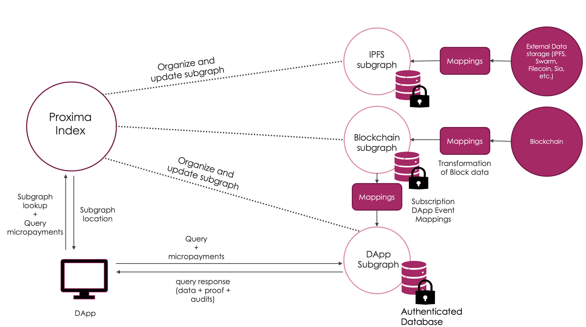
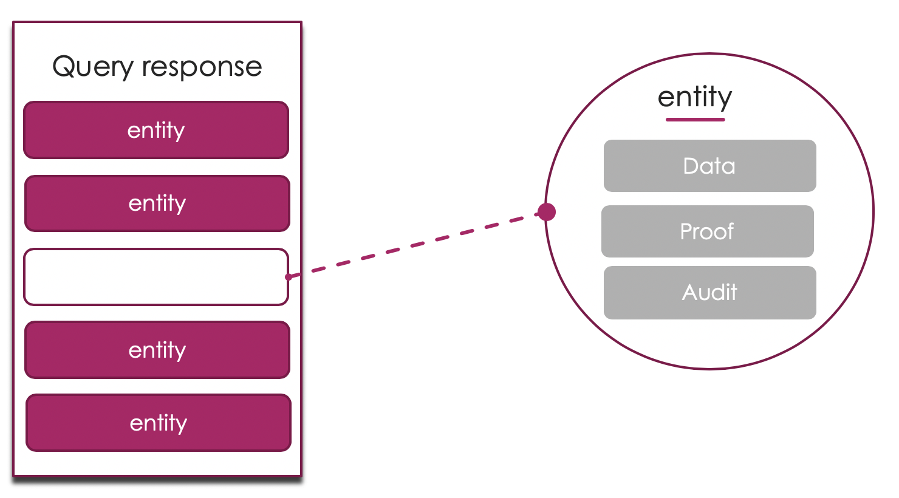

# How it works

## What do we do?

**Blockchain data is tough to truly authenticate.**

How do you know that you are getting accurate and sound data from the correct blockchain? You have no idea if the data coming from your account balance, query, or Decentralized application events are accurate and timely. The result can lead to major issues with visibility, analytics, and finances within your business. It can mean the difference between success or failure.

### Examples

- _Did my user pay? What are the interest rates?_
- _How many users are there? What do my orders look like?_
- _What is my account balance? What transactions have I been a part of?_

When dealing with data security it is not enough to “trust”. Proxima provides the convenience, feature set, and speed of centralized providers **AND** maintains the audibility and security of the blockchain.

## Our goal
Decentralize the ability to **provide data, interact with data** to **empower DApp developers**, provide tools that **speed up the creation of DApps**, and **drive adoption of blockchain technology**. Our solution is general enough to **enable our decentralized data providers** to provide data for DApps **for several blockchains / smart contract platforms**, while basing our **security on the consensus of the blockchain that the data is coming from**.

## Our Product
We provide default event mappings for every developer so there is no setup needed aside from listing the contract ABI code, the data source, and the address. Moreover, our methodology does not employ any consensus method for queries or writes because it ties the data in each with the blockchain itself.

## Benefits

- **Security**
Instead of relying on the consensus or trust of another data provider, the security of the data on Proxima is gauranteed by the blockchain that the developer uses. This is done by creating a trail between every piece of data in Proxima, and the block that it originates from.

- **Lower latency**
Queries for data in Proxima need to have only one hop, this creates an experience that is similar to the traditional request-response method. Other such methods have consensus mechanisms for queries, which can lead to quadratic bounds with regard to the number of messages being passed.  

- **Lower cost**
Traditional approaches for data delivery, require large clusters of nodes to run consensus on individual queries. This is ineffective, and lowers the security. Through Proxima, each query does not need trust because it can be audited. This lowers the cost to serve a query to match traditional standards. Furthermore, it does not need trust so it opens up the ability to serve data which can further drop the price.


### Features

- _Events, State_
- _Filtering (soundness, not completeness), Range_ (soundness, not completeness)\*
- _Blockchain agnostic_
- _Trustless data_
- _Performant queries_


## Stakeholders
*There exist three major stakeholders in the Proxima ecosystem.*

- **Blockchains**
Blockchains suffer from two major issues adoption and data delivery. In order to be sustainable blockchains need to have a way to easily get data from the chain, and they need a highly secure, cost effective method to maintain this infrastructure indefinitely. Through Proxima, these blockchains do not need to compromise on any of these aspects.

- **Decentralized Applications**
Decentralized applications can use Proxima, as a method for maintaining an easy connection to the data that preserves security. Instead of building their own custom caching and data solutions, these applications can build on top of a highly secure, blazing fast data provider.

- **Users**
Users receive faster performance and a more diverse experience. This can be seen with faster page load times, and a real-time experience.  

### Example Use Case

#### Goal

A developer wants to query the blockchain, to get data from a specific DApp, a decentralized exchange. This DApp utilizes multiple smart contracts to maintain orderbooks and reserves in a decentralized manner. The goal is to get a cohesive view of the orderbooks, reserves, and exchange in a fast, secure manner.

#### Problem

The current method of blockchain querying would be to have the developer write a custom-solution that queries each individual contract, formats the data, and delivers it to the user. Along with being difficult to create for the developer, this type of system experiences high latency with requests taking minutes.

#### Solution

The developer can make a Proxima data node that incorporates subgraphs for each of the reserves and orderbooks for their exchange. These subgraphs can be autogenerated to collect events, state, and ensure that this state is truly tied to the blockchain through an authenticated data structure. This enables the developer to have faster queries by several orders of magnitude, while maintaining the security of the blockchain they are querying from.

#### Outcomes

- Faster queries
- Lower storage footprint
- Trustless queries
- Greater Scalability
- Easier interface
- Lower costs

## How do we do it?
Proxima provides default mapping of events and stores them within an authenticated data store, giving developers the ability to query this through a graphQL interface. Queries are done through a specialized node that uses an authenticated data store to provide a Merkle-proof for the query. To ensure the security of the data, Proxima leaves an auditable trail for DApp developers to trace the path of their data to its source. We cannot change the authenticated data structure, so security does not have to be re-tried by each new user.



### Index Nodes
The index node is responsible for connecting the queries to the correct "subgraph". They will maintain a smart contract index of subgraphs, and eventually be responsible for dealing with payments and subscriptions. The index of subgraphs will be represented as a smart contract on Ethereum through the testnet phase. Eventually the index will be migrated to a higher throughput chain, like the tendermint sidechain on Cosmos.

_Note: the index nodes do not actually store any "subgraphs", they simply connect to subgraphs stored by the query nodes._

### Query Nodes

Query nodes are responsible for storing and providing data for subgraphs. Query nodes can be deployed to our hosting DNS service through a manifest that defines data sources, contracts, and any extra mappings. This manifest is deployed to the IPNS, to enable deployment to the mesh as well as deployment to our own hosting solution.

### Subgraphs

Subgraphs represent a contained data set that can be queried, auditted, and reused within the Proxima network. The easiest analogy for subgraphs, is that they represent tables of data complete with schema, transformations, and queries.

```
subgraph
  entities:
    - ...
  schema:
    - ...
  mappings:
    - ...
  datasources:
    -  ...
```

### Entities

Entities are formulations of objects in Proxima. They can represent Users, Accounts, Items, Orders, etc. The entity will define the values, the "audits" associated with the values, and how to index/write the objects to the authenticated database.

#### Schema

The schema exists as a part of the entity, it will enable queries, and show the data that is held within the entity. This
schema will eventually be able to contain other entities.

#### Verification

Each entity has a function(s) that will verify the validity of the data they hold. An example of this would be a block  
 entity have a verification function that ensures the blockhead hashes to the blockhash.

#### Audits

An entity will have data from other sources, it is necessary to be able to audit this data. Entities have specific  
 subroutines that take run queries on subgraphs. These queries are known as "audits", and they will ensure the validity of
the data given. An example of such an audit would be a query for a Transaction that checks if the block, associated with the
blockHash, exists.

#### Example: Transaction

An example entity to use is a transaction, (a UTXO in this case). Look at how the schema defines the data, the

#### Schema

    ```
    Transaction {
        transactionHash: Uint256
        from: Address
        to: Address
        value: Uint256
        signature: bytes
        blockHash: Uint256
    }
    ```

#### Verification

The verification in this case would be to ensure that the signed Transaction was hashed to the correct Hash. Put simply it would look like:

```javascript
function verification(Transaction, transactionHash) {
  return keccak256(Transaction) == transactionHash;
}
```

#### Audits

The auditting process would include a query and a validation function. For the transaction it would query the blockHash,
then it would perform the validation function that checks that the transaction is in Transaction Trie of the selected
Block.

```javascript
function AuditTransaction(Transaction) {
  Block = Query(Transaction)
  return Block AND Validate(Transaction, Block)
}
```

##### Query

```javascript
function Query(Transaction) {
   Block, Proof = get('subgraph blocks', Transaction.BlockHash)
   if Proof.verify:
     return Block
   return null
}
```

##### Validation

```javascript
function Validate(Transaction, Block) {
  return Transaction.Hash in Block.TransactionTrie;
}
```

### Datasources

Subgraphs can be used by other subgraphs (e.g. Ethereum subgraph being used by DApps), these are defined as datasources.

#### Subgraphs

Subgraphs can be used as a datasource for other subgraphs. These subgraphs are referenced and used through the Proxima Index Node. This method makes it easy to define and use subgraphs.

```
  datasource:
      type: Subgraph
       id: Ethereum-Subgraph
      name: Ethereum
```

#### External data sources

External datasources are more difficult to build, and must contain pre-built entities. By doing this it is possible to use the external datasource in the same manner that a subgraph can be used.

```
  datasource:
      type: External
      name: Ethereum
      ingestor: ...
      entities: ...
      mapping:
      - handlers
      - abi/schema
```

## Queries

Queries in Proxima, are given responses that are broken into entities. Each entity represents an individual data record that is being requested in the query itself. Since they are designed to be verifiable, they have components for proofs audits.



Each _entity_ within a query is composed of the following attributes:

#### Data

The data contained within each identity is associated with the schema of the entity itself. This is what the query is looking at.

#### Proof

This is the _proof-of-membership_ within the Proxima Database. The Proof itself relies on the Merkle root of the database, and is authenticated with the hash of the value.

#### Audits

The audit provides a _Proof-of-Correctness_ for the entity that is being queried, and is sourced by the entity itself. This involves conducting a separate query query of data that is directly tied to the entity. For example, a transaction "audit" would return the block whose blockhash is referenced by the transaction, and a proof-of-membership for this block.

## Authenticated Datastore

Proxima uses ProximaDB, a bolt-on component of the powerful Urkel NoSQL database, that implements a Flat-File Merkle Trie (FFMT). We utilize the Flat-File Merkle Trie, like see in Urkel, because of the query speed (>1 ms), the reduced size of the proofs (>1kb), as well as the low storage footprint. FFMTs are especially useful in this implementation because they map from the internal nodes of the trie directly to the location of the data that they are referencing. For more information on this check out the [Handshake paper](https://handshake.org/files/handshake.txt).

Along with adding features like range queries and load-balancing, Ruffle provides the default authentication and performance seen in the Urkel database. Our data store provides Merkle proofs for data to ensure the authenticity and immutability of all data within it.

## Audits

The blocks of a blockchain are immutable, but blocks are only linked to their immediate neighbors, so the history of the blockchain can only be verified by downloading the entire chain. This means that it is only possible to audit data (e.g. transactions, state, and blocks) from a blockchain, by running a full node and synchronizing with every block in the blockchain’s history.

Our system maintains the same auditing structure of blockchains, but it stores blocks within an authenticated database, so it is possible to verify membership of blocks without downloading the entire history. This enables fast and efficient audits.

### Example Audits

- _Is this block a part of the Ethereum block?_
- _Is this transaction really embedded in this block?_
- _Is this state located in the state trie for the current block?_

Audits like these can be called within a query to guarantee that the information provided is correct. Audits can also be chained together in a recursive manner, this is known as an audit trail. As our product progresses, audits can be updated and added to improve the security and rigor of the audit itself.

Audits and audit trails would take a lot of time if they are used for every query. Since the database is authenticated, probabilistic audits can be used by developers in instances where there is a high amount of overlap between queries. This lowers the number of audits needed to be completed for highly used sets while maintaining developer security guarantees.
